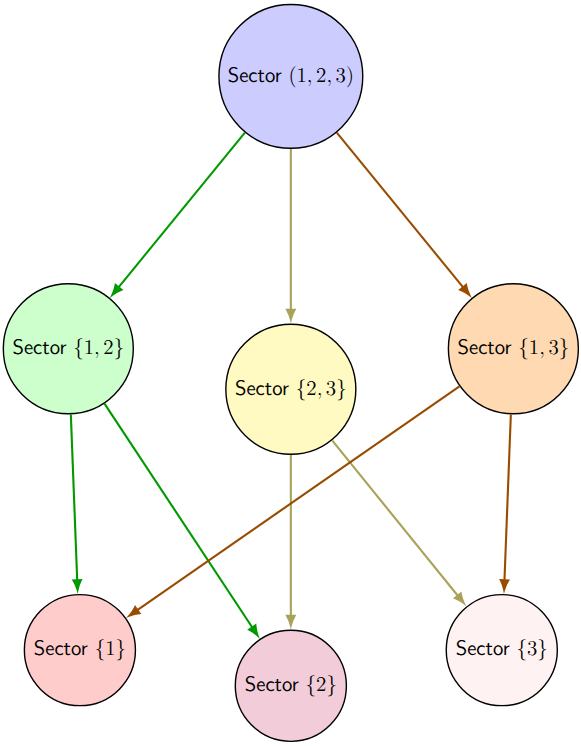

# Parallel Computation of Short IPB Systems



## Table of Contents

- [Overview](#overview)
- [Installation Guide](#installation-guide)
  - [Prerequisites](#prerequisites)
  - [Environment Setup](#environment-setup)
  - [Installation Steps](#installation-steps)
- [Quick Start](#quick-start)
  - [Using Setup Script](#using-setup-script)
  - [Manual Setup](#manual-setup)
- [Example Usage](#example-usage)
- [Troubleshooting](#troubleshooting)
- [Additional Resources](#additional-resources)

## Overview

This package provides a framework for automating the reduction of Feynman integrals using Integration-by-Parts (IBP) identities and sector decomposition. It transforms sector structures into directed acyclic graphs (DAGs) and generates Petri net representations for parallel computation using [GPI-Space](https://github.com/cc-hpc-itwm/gpispace).

## Installation Guide

### Prerequisites

#### Required System Packages:

```bash
sudo apt update
sudo apt install -y build-essential ca-certificates coreutils curl \
    environment-modules gfortran git gpg lsb-release python3 \
    python3-distutils python3-venv unzip zip
```

### Environment Setup

1. Create and set up working directory:

```bash
mkdir -p ~/singular-gpispace
cd ~/singular-gpispace
```

2. Set environment variables (add to `~/.bashrc` for persistence):

```bash
echo 'export software_ROOT=~/singular-gpispace' >> ~/.bashrc
echo 'export install_ROOT=~/singular-gpispace' >> ~/.bashrc
source ~/.bashrc
```

### Installation Steps

1. **Install Spack**:

```bash
# Clone Spack
git clone https://github.com/spack/spack.git $software_ROOT/spack

# Switch to stable version
cd $software_ROOT/spack
git checkout releases/v0.23

# Initialize Spack
. $software_ROOT/spack/share/spack/setup-env.sh

# Bootstrap Spack
spack spec zlib
```

2. **Install gspc-feynman**:

```libbash
# Add package repository
git clone https://github.com/singular-gpispace/spack-packages.git $software_ROOT/spack-packages
spack repo add $software_ROOT/spack-packages

# Install package
spack install gspc-feynman
```

3. **Configure Environment**:

```bash
# Set environment variables
export GSPC_FEYNMAN_INSTALL_DIR=$(spack location -i gspc-feynman)
export GPI_SPACE_HOME=$(spack location -i gpi-space@24.12)
export GSPC_HOME=$GPI_SPACE_HOME
export SINGULAR_INSTALL_DIR=$(spack location -i singular@4.4.0p2)
export GSPC_FEYNMAN_EXAMPLES_DIR=$GSPC_FEYNMAN_INSTALL_DIR/share/examples
export SINGULARPATH=$GSPC_FEYNMAN_INSTALL_DIR
export LD_LIBRARY_PATH=$GSPC_HOME/lib:$GSPC_FEYNMAN_INSTALL_DIR/lib:$LD_LIBRARY_PATH
```

## Quick Start

### Using Setup Script

The recommended way to start is using the provided setup script:

```bash
$GSPC_FEYNMAN_INSTALL_DIR/libexec/setup.sh
```

After pressing `Ctrl+C` to stop watching the monitor:

```bash
# Change to working directory
cd $software_ROOT

# Load Singular
spack load singular@4.4.0p2

# Start Singular
Singular
```

### Manual Setup

If you prefer manual setup:

```bash
# Create logs directory
mkdir -p $software_ROOT/logs

# Get GPI-Space binary path
GPISPACE_BIN=$(spack location -i gpi-space@24.12)/bin

# Start monitor with logging
[ -f $software_ROOT/logs/monitor.txt ] && rm $software_ROOT/logs/monitor.txt
cd $GPISPACE_BIN && ./gspc-logging-to-stdout.exe --port 9876 >> $software_ROOT/logs/monitor.txt 2>&1 &

# Monitor the output
tail -f $software_ROOT/logs/monitor.txt
```

## Example Usage

```singular
LIB "templategspc.lib";

// Configure GPI-Space
configToken gc = configure_gspc();
gc.options.tmpdir = "tempdir";
gc.options.nodefile = "nodefile";
gc.options.procspernode = 4;
gc.options.loghostfile = "loghostfile";
gc.options.logport = 9876;

// Define graph structure
ring R = 0, x, dp;
list v = list(1, 2, 3, 4, 5, 6);  // vertices
list e = list(
    list(6, 1),    // edge 6->1
    list(4, 6),    // edge 4->6
    list(1, 2),    // edge 1->2
    list(3, 5),    // edge 3->5
    list(4, 3),    // edge 4->3
    list(2, 5),    // edge 2->5
    list(5, 6),    // edge 5->6
    list(1),       // external leg 1
    list(2),       // external leg 2
    list(3),       // external leg 3
    list(4)        // external leg 4
);

// Define target integrals
list targetInt = list(
    list(1, 1, 1, -1, -3, -1, -1, -1, -1),
    list(1, -1, 1, -1, -3, -1, -1, -4, -1)
);

// Compute sector decomposition
list L = v, e, targetInt;
def re = gspc_feynman(L, gc);
```

## Troubleshooting

### Common Issues

1. **Monitor Not Starting**

   - Check if port is in use:
     ```bash
     netstat -tuln | grep 9876
     ```
   - Check log file:
     ```bash
     cat $software_ROOT/logs/monitor.txt
     ```
   - If "Connection refused" errors in Singular:
     ```bash
     # Kill any existing monitor processes
     pkill -f gspc-logging-to-stdout.exe

     # Start monitor with proper environment
     export software_ROOT=~/singular-gpispace
     mkdir -p $software_ROOT/logs
     GPISPACE_BIN=$(spack location -i gpi-space@24.12)/bin
     cd $GPISPACE_BIN && ./gspc-logging-to-stdout.exe --port 9876 >> $software_ROOT/logs/monitor.txt 2>&1 &
     ```
2. **Module Loading Issues**

   ```bash
   # Reload modules
   spack load gpi-space@24.12
   spack load singular@4.4.0p2
   spack load gspc-feynman
   ```
3. **SSH Connection Issues**

   ```bash
   # Test SSH connection
   ssh localhost echo "SSH connection successful"

   # Regenerate SSH keys if needed
   ssh-keygen -t rsa -b 4096 -N '' -f ~/.ssh/id_rsa
   ssh-copy-id -f -i ~/.ssh/id_rsa localhost
   ```
4. **gpi-space@24.12 Not Found**
   If you encounter an error indicating that `gpi-space@24.12` is not found:

   ```bash
   # Run checksum command
   spack checksum gpi-space@24.12

   # When prompted, select version and press 'c' to checksum

   # Edit the package file
   spack edit gpi-space

   # Ensure it contains:
   ```

   Then restart from [Install gspc-feynman](#installation-steps)

### Environment Verification

```bash
# Check environment variables
echo "SINGULAR_INSTALL_DIR: $SINGULAR_INSTALL_DIR"
echo "GSPC_FEYNMAN_INSTALL_DIR: $GSPC_FEYNMAN_INSTALL_DIR"
echo "GSPC_FEYNMAN_EXAMPLES_DIR: $GSPC_FEYNMAN_EXAMPLES_DIR"
echo "SINGULARPATH: $SINGULARPATH"

# Check file permissions
ls -l $software_ROOT/tempdir
ls -l $software_ROOT/nodefile
ls -l $software_ROOT/loghostfile
```

## Additional Resources

- [GPI-Space Documentation](https://github.com/cc-hpc-itwm/gpispace)
- [Singular Documentation](https://www.singular.uni-kl.de/)
- [Spack Documentation](https://spack.readthedocs.io/)

## Contributing

Contributions are welcome! Please feel free to submit a Pull Request.

## License

Apache License 2.0 - see [LICENSE](LICENSE) file
